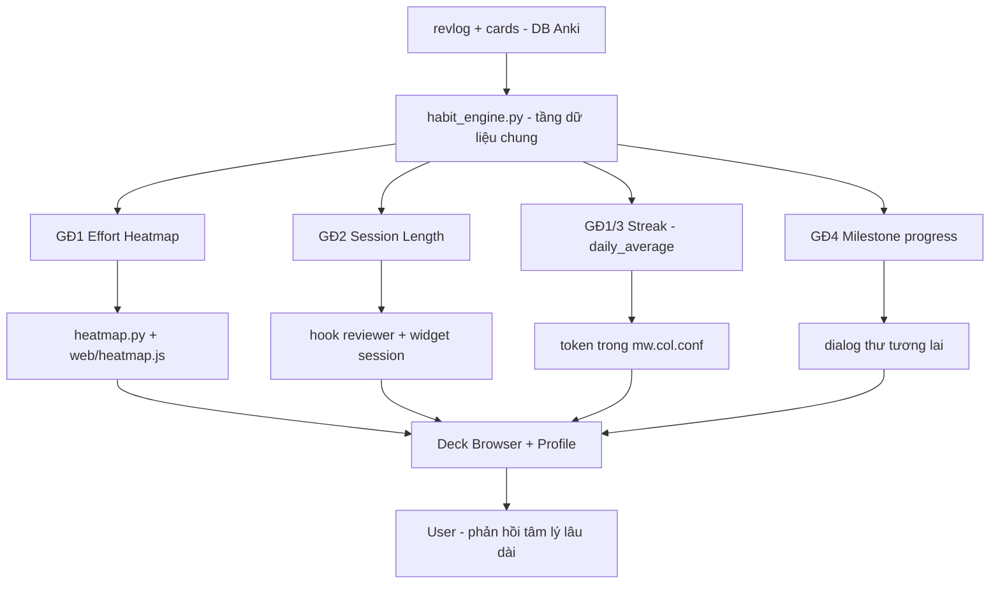

# 🍙 Onigiri — Habit Engine (Bộ công cụ duy trì thói quen lâu dài)

> Kế hoạch triển khai 4 tính năng theo lộ trình: **#2 Effort Heatmap (lõi)** → **#4 Adaptive Session Length** → **#1 Streak Insurance** → **#3 Future Self Letter**.
> Tất cả dùng chung một tầng dữ liệu (`habit_engine.py`) xây trên bảng `revlog` của Anki.

---

## 1. Tầng dữ liệu chung — `habit_engine.py` (mới)

Mọi tính năng đều cần "telemetry mỗi ngày": hôm nay học bao nhiêu, mất bao lâu, đúng bao nhiêu, độ khó thế nào. Hiện dữ liệu này đã nằm rải rác trong [`heatmap.py`](heatmap.py:8), [`onigiri_renderer.py`](onigiri_renderer.py:408), [`patcher.py`](patcher.py:549) — ta gom về một module.

### Bảng `revlog` (schema chuẩn Anki)

| Cột | Ý nghĩa | Dùng cho |
|-----|---------|----------|
| `id` | timestamp (ms) của review | nhóm theo ngày local |
| `cid` | card id | join `cards` để lấy độ khó |
| `ease` | 1-4 (Again/Hard/Good/Easy) | độ đúng (`ease > 1`) |
| `ivl` / `lastIvl` | interval | độ khó / độ sâu |
| `factor` | ease factor (×1000) | độ khó (Anki SM-2) |
| `time` | thời lượng review (ms) | effort, tốc độ |
| `type` | 0=learn, 1=review, 2=relearn, 3=filtered, 4=manual | lọc bỏ type 4 như code hiện tại |

### API đề xuất

```python
# habit_engine.py
def get_daily_telemetry(start_ms=None, end_ms=None):
    """
    Mỗi ngày (YYYY-MM-DD, theo rollover + localtime):
    {
      "2026-08-10": {
        "count": 120,
        "time_ms": 3600000,
        "correct": 108,          # ease > 1
        "avg_ivl": 21.4,
        "difficulty": 0.42,      # 0..1, từ cards.ease / FSRS stability
      }, ...
    }
    """

def get_effort_score(day_telemetry, weights) -> float:
    """
    effort = w_time * norm_time + w_correct * norm_correct + w_diff * norm_difficulty
    Normalize theo daily_average của chính user để so sánh được giữa các ngày.
    """

def get_review_speed_history(days=14) -> list[float]:
    """cards/phút trung bình mỗi ngày — phục vụ GĐ2."""

def get_rolling_avg_volume(days=14) -> float:
    """Số thẻ trung bình động — phục vụ GĐ2 (target) và GĐ1 (chuẩn hóa)."""
```

- Tái sử dụng **toàn bộ logic timezone/rollover** đã có trong [`heatmap.py`](heatmap.py:18) (biến `rollover_hour`, `day_cutoff`, `STRFTIME localtime`).
- FSRS: độ khó lấy từ `cards.data` (JSON chứa `stability`/`difficulty`) nếu có, fallback về `cards.ease`. **Chỉ khi dùng FSRS** — chưa có code nào trong dự án dùng FSRS, nên đây là phần cần kiểm tra an toàn (try/except).

---

## 2. Giai đoạn 1 — Effort-Adjusted Heatmap (#2, lõi)

### Mục tiêu
Biến heatmap hiện tại thành 2 chế độ: **Count** (mặc định, như cũ) và **Effort** (màu theo nỗ lực thực: thời gian + độ đúng + độ khó), chống "tự lừa dối" khi học hời hợt.

### Thay đổi
| File | Thay đổi |
|------|----------|
| [`config.py`](config.py:7) | Thêm DEFAULTS: `heatmapEffortMode: bool`, `heatmapEffortWeights: {time, correct, difficulty}`, `heatmapEffortFormulaVersion: int` |
| `habit_engine.py` | (mới) `get_daily_telemetry()` + `get_effort_score()` |
| [`heatmap.py`](heatmap.py:8) | `get_heatmap_and_config()` trả thêm `effort_by_day` (đã tính sẵn score) + `effort` config; giữ nguyên payload cũ để không vỡ JS hiện tại |
| [`web/heatmap.js`](web/heatmap.js:10) | Thêm trạng thái `mode` ('count'|'effort'); `getIntensityLevel()` nhận thêm mode — effort dùng scale riêng (0-100 score → 8 level); tooltip hiển thị breakdown (vd: "1h 12m · 92% đúng · độ khó TB"); thêm toggle trong header (`heatmap-filters` thêm nút Count/Effort) |
| [`settings.py`](settings.py:5637) | Mục Heatmap: toggle Effort Mode + 3 slider trọng số + nút reset về mặc định; lưu trong `_save()` (vùng `10851` trở đi) |

### Lưu ý
- **Không phá vỡ dữ liệu cũ**: `get_heatmap_data()` giữ nguyên contract (`calendar`, `streak`, `due_calendar`...). Effort là trường **thêm mới** — JS cũ vẫn render được nếu chưa bật mode.
- Render entry point: [`__init__.py`](__init__.py:280) `on_deck_browser_did_render()` và [`patcher.py`](patcher.py:731) profile heatmap — gọi `get_heatmap_and_config()` nên chỉ cần sửa bên trong module này, không cần sửa chỗ gọi.

---

## 3. Giai đoạn 2 — Adaptive Session Length (#4)

### Mục tiêu
Anki đề xuất số thẻ nên học hôm nay dựa trên **tốc độ lịch sử + khối lượng trung bình + mood 1 click**, tránh burnout.

### Thay đổi
| File | Thay đổi |
|------|----------|
| `habit_engine.py` | `get_review_speed_history()` + `get_rolling_avg_volume()` |
| [`__init__.py`](__init__.py:339) | Hook `reviewer_did_answer_card` ghi thêm telemetry phiên (thời điểm bắt đầu/đếm thẻ hôm nay) — tái dùng block đang có; giữ nhẹ, không `setMod()` thừa (đã là điểm nghẽn hiệu suất theo ARCHITECTURE.md) |
| [`webview_handlers.py`](webview_handlers.py:8) | Thêm `onigiri_mood:` → lưu mood + tính lại target |
| `onigiri_renderer.py` | Widget mới `"session"` trong `widget_generators` ([`onigiri_renderer.py`](onigiri_renderer.py:424)) + layout mặc định trong config |
| [`config.py`](config.py:116) | Thêm DEFAULTS: `sessionSuggestEnabled`, `mood`, `sessionHistory` |
| Settings | Bật/tắt widget + mood mặc định |

### Công thức đề xuất
```
target = clamp( rolling_avg_volume * mood_multiplier, min, max )
mood_multiplier:  mệt=0.6, bình thường=1.0, hype=1.3
min/max:  dựa trên tốc độ (không vượt quá sức một phiên điển hình, ~ dựa speed_history)
```

---

## 4. Giai đoạn 3 — Streak Insurance (#1)

### Mục tiêu
Token "bảo hiểm" chuỗi ngày dựa trên **loss aversion** — học vượt mục tiêu hôm trước thì có token cứu streak khi lỡ một ngày.

### Thay đổi
| File | Thay đổi |
|------|----------|
| [`__init__.py`](__init__.py:339) | Trong hook trả lời thẻ: nếu vượt ngưỡng mục tiêu trong ngày (dựa `daily_average` từ heatmap) → +1 token/lần vượt (có cap); lưu `mw.col.conf["onigiri_streak_tokens"]` |
| [`heatmap.py`](heatmap.py:79) | Hàm kiểm tra "ngày hôm qua có bị lỡ không" (dựa logic streak hiện tại) |
| `habit_engine.py` hoặc `heatmap.py` | Hàm `consume_token_to_protect()`: nếu lỡ hôm qua + có token → cộng 1 ngày vào streak tính toán, đánh dấu đã dùng |
| [`web/notifications.js`](web/notifications.js:1) | Thông báo "Token bảo hiểm đã cứu streak của bạn" |
| Widget deck browser | Hiển thị số token (đếm 🔰) |

### Lưu ý
- Streak hiện tính trực tiếp mỗi lần render ([`heatmap.py`](heatmap.py:89)) — token sẽ là **lớp hiệu chỉnh** trên con số streak trước khi hiển thị, không sửa database lịch sử.

---

## 5. Giai đoạn 4 — Future Self Letter (#3)

### Mục tiêu
Viết thư cho "bạn của tương lai" ở mốc này, hiện lại đúng mốc kế tiếp — khai thác **self-continuity**.

### Thay đổi
| File | Thay đổi |
|------|----------|
| [`config.py`](config.py:7) | DEFAULTS: `milestones` (streak: 30/90/180, total_cards: 1000/5000), `letters: {key: {written_at, deliver_at, text}}` |
| `habit_engine.py` | `get_milestone_progress()` — so streak hiện tại + tổng thẻ với danh sách mốc |
| [`welcome_dialog.py`](welcome_dialog.py) / file web mới | Dialog viết thư (kiểu web dialog như [`web/welcome.html`](web/welcome.html)) — form viết + ghi `mw.col.conf["onigiri_letters"]` |
| [`__init__.py`](__init__.py:243) | `on_profile_did_open()` thêm bước check milestone → mở dialog nếu đạt mốc + có thư cũ cần giao |
| Settings | Bật/tắt, xem danh sách thư đã viết |

---

## 6. Sơ đồ luồng dữ liệu



---

## 7. Kiểm soát hiệu suất

- `habit_engine.py` phải **cache** giống `_DASHBOARD_STATS_CACHE` / `_profile_stats_cache` trong [`onigiri_renderer.py`](onigiri_renderer.py:232) và [`patcher.py`](patcher.py:539) — chỉ query lại sau TTL hoặc khi ngày đổi.
- Tránh tăng thêm `mw.col.setMod()` mỗi lần bấm nút (đã là điểm nghẽn "Cao ⚡" trong [`ARCHITECTURE.md`](ARCHITECTURE.md:128)).
- FSRS parse `cards.data` phải nằm trong try/except, fallback về `cards.ease`.

## 8. Tài liệu cần cập nhật khi hoàn tất

- [`ARCHITECTURE.md`](ARCHITECTURE.md:66) — thêm `habit_engine.py` vào quan hệ module + hook mới (`onigiri_mood`).
- [`CODE_MAP.md`](CODE_MAP.md:7) — thêm dòng mô tả module + widget `session` + handler mới.

---

## 9. Trạng thái triển khai (đã hoàn tất toàn bộ 5 giai đoạn)

Đã implement đủ GĐ1–GĐ5. Các điều chỉnh so với thiết kế ban đầu (quyết định kỹ thuật):

- **GĐ2 widget "session" là opt-in** — KHÔNG thêm vào `DEFAULTS.grid` vì `config.get_config()` deep-merge → sẽ tự xuất hiện cho user cũ, phá layout. User bật qua Settings → widget editor (drag "Suggested Session" từ archive) hoặc toggle trong section **"Habit Engine"**.
- **GĐ2-2 không cần hook riêng ghi phiên** — dữ liệu hôm nay lấy trực tiếp từ `revlog`, kèm `invalidate_cache()` ở hook trả lời thẻ (đã làm ở GĐ1-6). Tránh thêm `setMod()` mỗi lần bấm (điểm nghẽn hiệu suất).
- **GĐ3 hot path an toàn**: `track_today_review()` dùng `_streak_config()` cache TTL 20s để không đọc file settings từ disk mỗi thẻ; `avg_volume` cache theo ngày trong `mw.col.conf`; token lưu runtime, persist bởi `setMod()` có sẵn của hook EXP.
- **GĐ4 dùng Qt dialog** (`QDialog` + `QTextEdit` trong `future_letter_dialog.py`) thay vì web dialog — tự chứa, không cần file HTML mới.
- **State runtime** (mood, tokens, letters, today_count) nằm trong `mw.col.conf`, không ghi vào file settings — tránh ghi đĩa thường xuyên; chỉ các tuỳ chọn bật/tắt/trọng số nằm trong `settings_{profile}.json`.
- **Kiểm thử**: `python -m py_compile` toàn bộ module mới/sửa + `node --check web/heatmap.js` đều pass.
