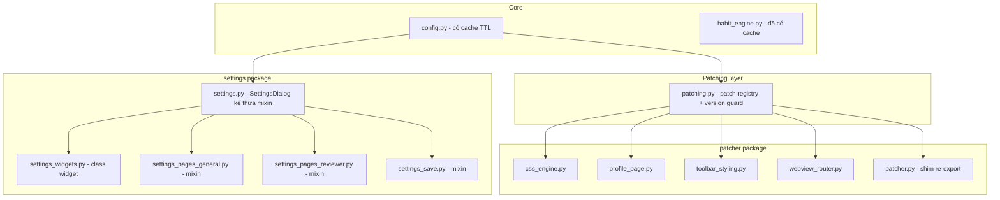

# 🍙 Onigiri — Hiện đại hóa P0 (Sức khỏe nền tảng)

> Kế hoạch Trục 1: **cache config + giảm monkey-patch + chia nhỏ patcher.py/settings.py**.
> Nguyên tắc tối thượng: **refactor giữ nguyên hành vi (behavior-preserving)** — không đổi logic, chỉ tái tổ chức; mỗi bước đều verify được độc lập.

---

## 1. Thực trạng (đã kiểm chứng)

| Vấn đề | Bằng chứng |
|--------|-----------|
| `config.get_config()` đọc file từ disk mỗi lần gọi | **41 chỗ gọi**, không cache (grep toàn repo) |
| Monkey-patch trực tiếp vào internals Anki | 5 chỗ: [`patcher.py`](patcher.py:1051) `Overview._table`, [`patcher.py`](patcher.py:1227) `Overview._body`, [`patcher.py`](patcher.py:1362) `Overview._show_finished_screen`, [`__init__.py`](__init__.py:277) `DeckBrowser._renderPage`, [`__init__.py`](__init__.py:282) `DeckBrowser._render_deck_node` |
| `patcher.py` khối nguyên khối | ~3.770 dòng, 48 hàm thuộc 8 nhóm chức năng khác nhau |
| `settings.py` khối nguyên khối | ~11.400 dòng, 1 class `SettingsDialog` + ~20 class widget helper |

---

## 2. Kiến trúc đích



**Điểm mấu chốt an toàn:** `patcher.py` và `settings.py` **giữ nguyên vị trí tên file** (mọi `from . import patcher` / `from . import settings` trong ~15 module khác không đổi) và trở thành lớp re-export/mixin — giảm rủi ro vỡ tham chiếu.

---

## 3. Giai đoạn A1 — Cache hóa config (Rủi ro: THẤP)

- Thêm vào [`config.py`](config.py:373):
  ```python
  _CONFIG_CACHE = {"data": None, "ts": 0.0}
  _CONFIG_TTL = 1.0  # giây
  def invalidate_config_cache(): ...
  ```
- `get_config()`:
  - Đầu hàm: nếu cache còn hạn → `return copy.deepcopy(_CONFIG_CACHE["data"])` (deepcopy **bắt buộc** vì nhiều caller mutate dict rồi `write_config` — tránh rò rỉ mutation vào cache).
  - Cuối hàm (sau khi merge + migration): lưu `deepcopy(clean_config)` vào cache.
- `write_config()`: gọi `invalidate_config_cache()`.
- Gọi `config.invalidate_config_cache()` trong `on_profile_did_open` (đổi profile).
- Verify: `grep config.get_config()` — đảm bảo không nơi nào phụ thuộc vào việc nhận đúng object identity.

## 4. Giai đoạn A2 — patching.py + version-guard (Rủi ro: TRUNG BÌNH)

- Tạo `patching.py` với:
  - `PATCHES: list[dict]` — registry: {name, apply, guard, fallback}.
  - Helper `_safe_apply(name, apply_fn, guard_fn)` → guard bằng `hasattr(klass, method)` + `anki.version` + try/except; thất bại → ghi log `Onigiri: skipped patch <name>`.
  - `apply_all_patches()` — gọi tất cả patch có guard (thay cho các phép gán trực tiếp hiện tại).
- Chuyển 5 monkey-patch vào đây:
  - `Overview._table`, `Overview._body` → `_safe_apply(..., guard=lambda: hasattr(Overview, "_table"))`.
  - `Overview._show_finished_screen` → dùng `wrap(..., "around")` bọc try/except.
  - `DeckBrowser._renderPage`, `DeckBrowser._render_deck_node` → guard `hasattr(DeckBrowser, ...)`.
- [`__init__.py`](__init__.py:270): thay các dòng gán trực tiếp bằng `patching.apply_all_patches()` — **giữ nguyên thời điểm** (top-level lúc import + `main_window_did_init`).
- Verify: patch thành công trên Anki hiện tại (giống hệt trước); khi mô phỏng thiếu attr → fallback, không crash.

## 5. Giai đoạn A3 — Chia nhỏ patcher.py (Rủi ro: TRUNG BÌNH-CAO)

- Bước 0: `grep "patcher\." *.py` → chốt danh sách tên cần re-export (kể cả tên gạch dưới như `_get_external_hooks`, `_onigiri_render_deck_node`).
- Tách theo cụm (8 nhóm phát hiện được):
  - `css_engine.py`: toàn bộ hàm sinh CSS (backgrounds, dynamic, icon/font, conditional, reviewer buttons, `_hex_to_rgba`, `_mix_colors`, `_render_background_css`...).
  - `profile_page.py`: `ProfileDialog`, `open_profile`, `_generate_profile_html_body`, các helper profile (`_get_profile_pic_html`...).
  - `toolbar_styling.py`: `apply_menu_styling`, `patch_qmenu`, `get_sync_status`, `_new_MainWebView_eventFilter`, `_update_toolbar_visibility`, `_on_sync_did_finish`.
  - `webview_router.py`: `on_webview_js_message`.
  - `patcher.py` → giữ `apply_patches`, `patch_overview`, `patch_congrats_page`, `take_control_of_deck_browser_hook`, `_onigiri_render_deck_node`, `_get_external_hooks`, `_get_hook_name` + **re-export toàn bộ tên từ các module mới**.
- Verify từng bước: `python -m py_compile` + import thử + grep tham chiếu.

## 6. Giai đoạn A4 — Chia nhỏ settings.py (Rủi ro: CAO — làm theo sub-step)

- **A4-1** (an toàn nhất): tách `settings_widgets.py` — các class widget độc lập (FlowLayout, AnimatedToggleButton, SectionGroup, ColorMapWidget, ModernColorPickerDialog, IconPickerDialog, ThemeCardWidget, DonationDialog, SearchResultWidget...). settings.py `from .settings_widgets import ...`.
- **A4-2 → A4-4**: chuyển `SettingsDialog` sang **mixin**:
  - `settings_pages_general.py` → `GeneralPagesMixin` (create_main_menu_page, create_colors_page, create_themes_page, create_sidebar_page, create_profile_tab, create_overviews_page, create_hide_modes_page, create_organize...)
  - `settings_pages_reviewer.py` → `ReviewerPagesMixin` (reviewer tab, buttons, notification position, bg options)
  - `settings_save.py` → `SaveMixin` (các `_save_*` + `save_settings` + `open_settings`)
  - `settings.py` → `class SettingsDialog(GeneralPagesMixin, ReviewerPagesMixin, SaveMixin, QDialog)` giữ `__init__` + `apply_stylesheet` + các helper dùng chung.
- Mỗi lần tách 1 mixin: chạy thử mở settings + tab tương ứng + Save.
- **Lưu ý MRO**: thứ tự kế thừa + phương thức trùng tên (vd `_create_scrollable_page`) phải đặt đúng mixin hoặc giữ ở lớp chính.

## 7. Giai đoạn A5 — Hồi quy & tài liệu

- `python -m py_compile` toàn bộ + `node --check web/*.js` + grep tham chiếu chéo.
- Checklist thủ công: mở Anki → deck browser (widget grid, heatmap, session, level bar) → overview → reviewer (bg, buttons, top bar) → profile page → settings mọi tab → Save không lỗi.
- Cập nhật [`ARCHITECTURE.md`](ARCHITECTURE.md:66) + [`CODE_MAP.md`](CODE_MAP.md:7).

---

## 8. Ma trận rủi ro & giảm thiểu

| Giai đoạn | Rủi ro | Giảm thiểu |
|-----------|--------|-----------|
| A1 config cache | Thấp — deepcopy tránh mutation leak | Trả deepcopy, invalidate khi write/profile |
| A2 patching | Trung bình — thứ tự patch | Giữ thời điểm gọi y hệt, guard hasattr |
| A3 chia patcher | Trung bình-Cao — sót re-export | Grep trước, shim explicit, compile từng bước |
| A4 chia settings | Cao — MRO/trùng tên/tab hỏng | Sub-step, test từng mixin, giữ `_create_scrollable_page` ở lớp chính |

**Thứ tự khuyến nghị khi vào Code mode:** A1 → A2 → A3 → A4 → A5. Mỗi giai đoạn là một checkpoint độc lập; nếu A4 quá rủi ro có thể dừng ở A4-1 (tách widget) và để A4-2→A4-4 cho đợt sau.

---

## 9. Trạng thái triển khai (đợt 1)

| Giai đoạn | Trạng thái | Ghi chú |
|-----------|-----------|---------|
| A1 config cache | ✅ Xong | `_CONFIG_CACHE` TTL 1s; `get_config()` trả deepcopy; `invalidate_config_cache()` khi write/mở profile. |
| A2 patching | ✅ Xong | `patching.py`: `_safe_apply` (hasattr + try/except fallback, log warning); `apply_congrats_patch()`, `apply_overview_patch()`, `apply_deck_browser_render_patches()`; `__init__.py` dùng thay phép gán trực tiếp. |
| A3 chia patcher | ✅ Xong | `patcher.py` 3.780 → **1.095 dòng**. Tách: `css_engine.py` (2039), `toolbar_styling.py` (228), `profile_page.py` (384), `webview_router.py` (199). patcher.py = shim re-export; `tools/check_patcher_refs.py` xác nhận **mọi `patcher.*` resolve**. |
| A4 chia settings | ⏸️ HOÃN | Rủi ro cao (mixin `SettingsDialog` 11k dòng); không verify runtime khi thiếu Anki; lệch → add-on không load. Làm khi có môi trường Anki thật (bắt đầu A4-1 tách widget). |
| A5 hồi quy + docs | ✅ Xong | `py_compile` toàn bộ + `node --check` + 3 checker tĩnh pass; cập nhật `ARCHITECTURE.md`/`CODE_MAP.md`. |

**Công cụ tạo trong đợt này** (tái dùng cho đợt sau):
- `tools/check_undefined.py` — AST: tên dùng nhưng không định nghĩa (không cần Anki).
- `tools/check_patcher_refs.py` — AST: xác nhận mọi `patcher.<name>` ngoài module resolve.
- `tools/split_patcher.py` / `tools/split_patcher_rest.py` — trích chính xác theo AST, compile-then-replace.

**Bug thật được sửa trong đợt này:** `__init__.py` thiếu `from . import heatmap` → heatmap deck browser (gồm Effort Heatmap GĐ1) không render, bị try/except nuốt lỗi.

**Lưu ý:** `settings_helpers.py` có lỗi indent từ trước (không được import, không phải do refactor này).
